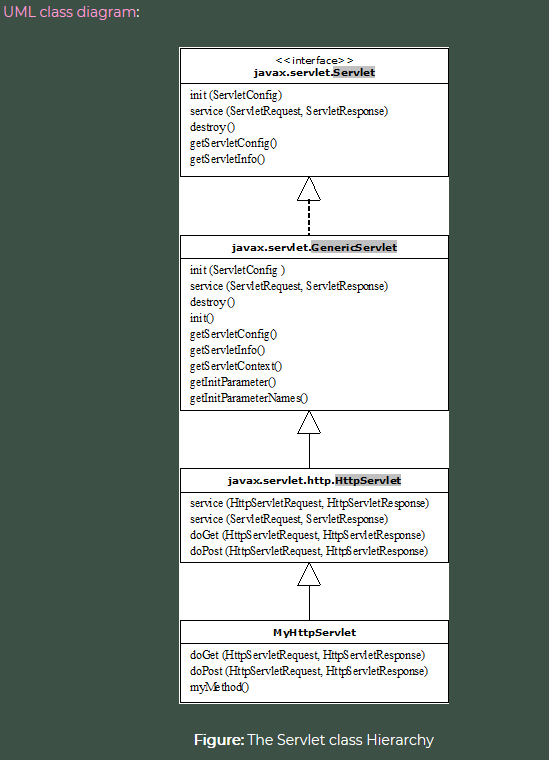

# Project 1 Notes

Below are curricula notes that are likely relevant to upcoming Project 1 work. 

## Life Cycle Of A Servlet

Servlet containers manage the life cycle of a servlet.

Three Servlet life cycle methods:
1. init(): initializes servlet `public void init() throws ServletException {
}`
2. service()
3. destroy()

Steps in Servlet life cycle:
1. **Load Servlet**: Application server starts up, servlet container deploys and loads all servlet classes
2. **Create instance of Servlet**: By default, after servlet classes loaded, the servlet container creates one instance of each servlet class. Application servers may create multiple instances of a servlet to handle high volume of incoming requests.
3. **Invoke `init()` method once**: After servlet classes are instantiated, `init()` initializes each servlet.
4. **Invoke `service()` method repeatedly for each client request**: 

## Servlet Inheritance/Class Hierarchy

Servlet- class instance which implements javax.servlet.Servlet interface
- however, most extend one of the standard implementations of this interface, such as `javax.servlet.GenericServlet` and `javax.servlet.http.HttpServlet`



- Servlet interface- contains life cycle methods, `getServletConfig()` and `getServletInfo()`
  - GenericServlet- abstract class that implements Servlet and that has additional "gets"
  - HttpServlet- abstract class that extends GenericServlet and defines "service" methods for HTTP and Servlet requests/responses

## Creating A Custom Servlet

[getting-started-with-tomcat-and-java](https://medium.com/@ngotantien/how-to-install-apache-tomcat-9-on-windows-mac-os-x-ubuntu-and-get-started-with-java-servlet-45f959d7ee0a)

## Deployment Descriptor (web.xml)

***TLDR: XML file that maps URL Paths to Servlets and that Application Servers use to route HTTP requests to the appropriate Servlet***

- Defines URLs that map to servlets
  - Tells the appliication server to find the appropriate servlet **per path and method of HTTP request**
- Determines which URLs require authentication and additional info
- Specifies classes, resources and configuration of the application and how the web server users them to serve HTTP requests
- Located in the app's Web Application Resource/ARchive (WAR) file beneath the WEB-INF directory
- Root element of web.xml is `<web-app>`

## Servlet Declarations And Mapping

- Declare servlet with `<servlet>` element
  - `<servlet-name>`- must be unique across deployment descriptor
  - `<servlet-class>`- fully-qualified class name
  - plus any additional initialization parameters
- Map URL path to servlet with `<servlet-mapping>` element
  - `<servlet-name>`
  - `<url-pattern>`- uses `*` wildcard (zero or more of any character)

```
<web-app xmlns="http://xmlns.jcp.org/xml/ns/javaee"
         xmlns:xsi="http://www.w3.org/2001/XMLSchema-instance"
         xsi:schemaLocation="http://xmlns.jcp.org/xml/ns/javaee
         http://xmlns.jcp.org/xml/ns/javaee/web-app_3_1.xsd"
         version="3.1">
    <servlet>
        <servlet-name>servlet1</servlet-name>
        <servlet-class>com.revature.MyFirstServlet</servlet-class>
    </servlet>
    <servlet-mapping>
        <servlet-name>servlet1</servlet-name>
        <url-pattern>/*</url-pattern>
    </servlet-mapping>
</web-app>
```

## HTTP - Request/Response Contents, Verbs, Status Codes

### Verbs

#### [GET](https://developer.mozilla.org/en-US/docs/Web/HTTP/Methods/GET)
  The GET method requests a representation of the specified resource. Requests using GET should only retrieve data.

  `GET /index.html`

#### [HEAD](https://developer.mozilla.org/en-US/docs/Web/HTTP/Methods/HEAD)
  The HEAD method asks for a response identical to that of a GET request, but without the response body.

  `HEAD /index.html`

#### [POST](https://developer.mozilla.org/en-US/docs/Web/HTTP/Methods/POST)
  The POST method is used to submit an entity to the specified resource, often causing a change in state or side effects on the server.

  A simple form using the default `application/x-www-form-urlencoded` content type:

  ```
  POST /test HTTP/1.1
  Host: foo.example
  Content-Type: application/x-www-form-urlencoded
  Content-Length: 27

  field1=value1&field2=value2
  ```

  A form using the `multipart/form-data` content type:

  ```
  POST /test HTTP/1.1
  Host: foo.example
  Content-Type: multipart/form-data;boundary="boundary"

  --boundary
  Content-Disposition: form-data; name="field1"

  value1
  --boundary
  Content-Disposition: form-data; name="field2"; filename="example.txt"

  value2
  --boundary--
  ```

#### [PUT](https://developer.mozilla.org/en-US/docs/Web/HTTP/Methods/PUT)
  The PUT method replaces all current representations of the target resource with the request payload.

  Request

  ```
  PUT /new.html HTTP/1.1
  Host: example.com
  Content-type: text/html
  Content-length: 16

  <p>New File</p>
  ```

  Responses

  If the target resource does not have a current representation and the PUT request successfully creates one, then the origin server must inform the user agent by sending a 201 (Created) response.

  ```
  HTTP/1.1 201 Created
  Content-Location: /new.html 
  ```

  If the target resource does have a current representation and that representation is successfully modified in accordance with the state of the enclosed representation, then the origin server must send either a 200 (OK) or a 204 (No Content) response to indicate successful completion of the request.

  ```
  HTTP/1.1 204 No Content
  Content-Location: /existing.html
  ```

#### [DELETE](https://developer.mozilla.org/en-US/docs/Web/HTTP/Methods/DELETE)
  The DELETE method deletes the specified resource.

  Request

  `DELETE /file.html HTTP/1.1`

  Responses

  If a DELETE method is successfully applied, there are several response status codes possible:
  - A 202 (Accepted) status code if the action will likely succeed but has not yet been enacted.
  - A 204 (No Content) status code if the action has been enacted and no further information is to be supplied.
  - A 200 (OK) status code if the action has been enacted and the response message includes a representation describing the status.

  ```
  HTTP/1.1 200 OK
  Date: Wed, 21 Oct 2015 07:28:00 GMT

  <html>
    <body>
      <h1>File deleted.</h1>
    </body>
  </html>
  ```

#### [CONNECT](https://developer.mozilla.org/en-US/docs/Web/HTTP/Methods/CONNECT)
  The CONNECT method establishes a tunnel to the server identified by the target resource.

  Some proxy servers might need authority to create a tunnel. See also the Proxy-Authorization header.

  ```
  CONNECT server.example.com:80 HTTP/1.1
  Host: server.example.com:80
  Proxy-Authorization: basic aGVsbG86d29ybGQ=
  ```

#### [OPTIONS](https://developer.mozilla.org/en-US/docs/Web/HTTP/Methods/OPTIONS)
  The OPTIONS method is used to describe the communication options for the target resource.

  Identifying allowed request methods

  To find out which request methods a server supports, one can use the curl command-line program to issue an OPTIONS request:

  `curl -X OPTIONS https://example.org -i`

  The response then contains an Allow header that holds the allowed methods:

  ```
  HTTP/1.1 204 No Content
  Allow: OPTIONS, GET, HEAD, POST
  Cache-Control: max-age=604800
  Date: Thu, 13 Oct 2016 11:45:00 GMT
  Server: EOS (lax004/2813)
  ```

  Preflighted requests in CORS

  In CORS, a preflight request is sent with the OPTIONS method so that the server can respond if it is acceptable to send the request. In this example, we will request permission for    these parameters:
  - The Access-Control-Request-Method header sent in the preflight request tells the server that when the actual request is sent, it will have a POST request method.
  - The Access-Control-Request-Headers header tells the server that when the actual request is sent, it will have the X-PINGOTHER and Content-Type headers.

  ```
  OPTIONS /resources/post-here/ HTTP/1.1
  Host: bar.example
  Accept: text/html,application/xhtml+xml,application/xml;q=0.9,*/*;q=0.8
  Accept-Language: en-us,en;q=0.5
  Accept-Encoding: gzip,deflate
  Connection: keep-alive
  Origin: https://foo.example
  Access-Control-Request-Method: POST
  Access-Control-Request-Headers: X-PINGOTHER, Content-Type
  ```

  The server now can respond if it will accept a request under these circumstances. In this example, the server response says that:

  Access-Control-Allow-Origin
      The https://foo.example origin is permitted to request the bar.example/resources/post-here/ URL via the following:
  Access-Control-Allow-Methods
      POST, GET, and OPTIONS are permitted methods for the URL. (This header is similar to the Allow response header, but used only for CORS.)
  Access-Control-Allow-Headers
      Any script inspecting the response is permitted to read the values of the X-PINGOTHER and Content-Type headers.
  Access-Control-Max-Age
      The above permissions may be cached for 86,400 seconds (1 day). 
  
  ```
  HTTP/1.1 204 No Content
  Date: Mon, 01 Dec 2008 01:15:39 GMT
  Server: Apache/2.0.61 (Unix)
  Access-Control-Allow-Origin: https://foo.example
  Access-Control-Allow-Methods: POST, GET, OPTIONS
  Access-Control-Allow-Headers: X-PINGOTHER, Content-Type
  Access-Control-Max-Age: 86400
  Vary: Accept-Encoding, Origin
  Keep-Alive: timeout=2, max=100
  Connection: Keep-Alive
  ```

#### [TRACE](https://developer.mozilla.org/en-US/docs/Web/HTTP/Methods/TRACE)
  The TRACE method performs a message loop-back test along the path to the target resource.

  `TRACE /index.html`

#### [PATCH](https://developer.mozilla.org/en-US/docs/Web/HTTP/Methods/PATCH)
  The PATCH method is used to apply partial modifications to a resource. 

  Request

  ```
  PATCH /file.txt HTTP/1.1
  Host: www.example.com
  Content-Type: application/example
  If-Match: "e0023aa4e"
  Content-Length: 100

  [description of changes]
```

  Response

  A successful response is indicated by any 2xx status code.

  In the example below a 204 response code is used, because the response does not carry a payload body. A 200 response could have contained a payload body.

  ```
  HTTP/1.1 204 No Content
  Content-Location: /file.txt
  ETag: "e0023aa4f"
  ```

### Status Codes

HTTP response status codes indicate whether a specific HTTP request has been successfully completed. Responses are grouped in five classes:

- [Informational responses](https://developer.mozilla.org/en-US/docs/Web/HTTP/Status#information_responses) (100–199)
- [Successful responses](https://developer.mozilla.org/en-US/docs/Web/HTTP/Status#successful_responses) (200–299)
- [Redirects](https://developer.mozilla.org/en-US/docs/Web/HTTP/Status#redirection_messages) (300–399)
- [Client errors](https://developer.mozilla.org/en-US/docs/Web/HTTP/Status#client_error_responses) (400–499)
- [Server errors](https://developer.mozilla.org/en-US/docs/Web/HTTP/Status#server_error_responses) (500–599)

#### Common Status Codes

##### Status code 200 – OK:
The HTTP status code 200 shows that the request was successfully carried out. All the requested data was located on the web server and transferred to the client. Internet users do not usually see this code.

##### Status code 301 – Moved Permanently:
The 301 code means that the data requested from the client cannot be found under the given address since it has been moved permanently. Since the current location of the requested content is delivered in the status report, the browser can request the new address straightaway. The user is then forwarded to the new address and the old address is no longer valid. The 301 code also goes unnoticed because the URL in the address bar simply changes.

##### Status code 302 – Moved Temporarily:
Unlike the 301 code, which is a permanent redirection, the 302 informs the user that the requested data has temporarily been moved. With a 302 code the remaining information is specified so that an automatic redirection can take place. The old address remains valid.

##### Status code 403 – Forbidden:
The HTTP status code 403 tells the client that the requested data is access-protected and that the request cannot be performed due to the client not having authority. An automatically generated HTML page will let the user know about the access problem.

##### Status code 404 – Not Found:
If the server delivers a 404 message it means that the requested website information was not found on the server. It could be that the address no longer exists or the contents were moved to a new address without notice. Users that receive a 404 message should check whether the address was written correctly in the address bar. Any links to non-existing pages are known as ‘dead links’.

##### Status code 500 – Internal Server Error:
The 500 server response functions as a collection status code for unexpected server errors. If an error occurs on the server’s part, which prevents the requested data from being retrieved, this HTTP status code will automatically be issued. As well as sending an answer to the client the webserver also creates an internal error report. This should be analyzed by the website owner so that repairs can be carried out on the server software.

##### Status code 503 ­– Service Unavailable:
If the user receives a 503 code it means that the relevant web server, which should deliver the requested information, is overloaded. The server response occasionally contains information about when the request can be processed at the earliest. Internet users can presume that an administrator is working on the problem and that the server will be available later on.

More important HTTP status codes are:
- HTTP 400 Bad Request
- HTTP 502 Bad Gateway
- HTTP 504 Gateway Timeout

## Idempotent And Safe Operations

***TLDR: Safe methods don't change anything internally (resources), idempotent methods don't change anything externally (response)***

### Idempotent:

An HTTP method is idempotent if an identical request can be made once or several times in a row with the same effect while leaving the server in the same state. In other words, an idempotent method should not have any side-effects (except for keeping statistics). Implemented correctly, the GET, HEAD, PUT, and DELETE methods are idempotent, but not the POST method. All safe methods are also idempotent.

To be idempotent, only the actual back-end state of the server is considered, the status code returned by each request may differ: the first call of a DELETE will likely return a 200, while successive ones will likely return a 404. Another implication of DELETE being idempotent is that developers should not implement RESTful APIs with a delete last entry functionality using the DELETE method.

Note that the idempotence of a method is not guaranteed by the server and some applications may incorrectly break the idempotence constraint.

### Safe HTTP Methods:

An HTTP method is safe if it doesn't alter the state of the server. In other words, a method is safe if it leads to a read-only operation. Several common HTTP methods are safe: GET, HEAD, or OPTIONS. All safe methods are also idempotent, but not all idempotent methods are safe. For example, PUT and DELETE are both idempotent but unsafe.

Even if safe methods have a read-only semantic, servers can alter their state: e.g. they can log or keep statistics. What is important here is that by calling a safe method, the client doesn't request any server change itself, and therefore won't create an unnecessary load or burden for the server. Browsers can call safe methods without fearing to cause any harm to the server; this allows them to perform activities like pre-fetching without risk. Web crawlers also rely on calling safe methods.

Safe methods don't need to serve static files only; a server can generate an answer to a safe method on-the-fly, as long as the generating script guarantees safety: it should not trigger external effects, like triggering an order in an e-commerce Web site.

It is the responsibility of the application on the server to implement the safe semantic correctly, the webserver itself, being Apache, Nginx or IIS, can't enforce it by itself. In particular, an application should not allow GET requests to alter its state.

